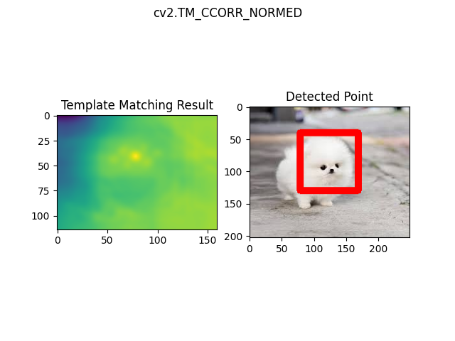

# Real-time Haar-cascade face/eye detection with median-adaptive Canny edge extraction

<br>

## Overview
This project aims to utilize the OpenCV library and a cascade classifier to detect and track keypoints such as the corners of the eyes and the edges of the face in images or videos. The cascade classifier is trained on a dataset of faces and eyes and then used to identify the keypoints. The library also includes functionality for detecting edges in images, which can aid in tasks like image segmentation and object recognition. The utilization of OpenCV provides a range of tools for image and video processing, including a cascade classifier, which ensures the library to detect keypoints and edges in real-time with high accuracy and reliability. Additionally, the OpenCV provides various image processing capabilities such as filtering, thresholding, and feature extraction that were utilized in this project.

<br>

## Getting Started
#### 1. Fork Ira and clone the repository:
  ```
  * git clone git://github.com/ak811/opencv-keypoint-detection.git
  ```
#### 2. Import the project via any Python IDEs:
  * Install [OpenCV](https://github.com/opencv/opencv):
  ``` 
  pip install opencv-python
  ```
  * Install [Matplotlib](https://github.com/matplotlib/matplotlib):
  ```
  pip install matplotlib
  ```
  * Install [NumPy](https://github.com/numpy/numpy):
  ```
  pip install numpy
  ```  
#### 3. You're ready to go!
  ```
  * The documentation will be provided soon.
  ```
  
<!-- View Documentation -->

<br>

## Real-Time Object Detection
#### Use the following function to open your device's webcam and detect the keypoints specified in your Python class.
 ~~~python
def live_detection_by_camera():
    cap = cv2.VideoCapture(0)

    while True:

        ret, frame = cap.read(0)

        frame = detect_face(frame)

        cv2.imshow('Video Face Detection', frame)

        c = cv2.waitKey(1)
        # Esc key
        if c == 27:
            break

    cap.release()
    cv2.destroyAllWindows()
  ~~~

<br>

## Face Detection

<br>


<br>
<br>

## Eye Detection

<br>
<br>

## Edge Detection

<br>
<br>

## Template Matching

<br>
<br>
